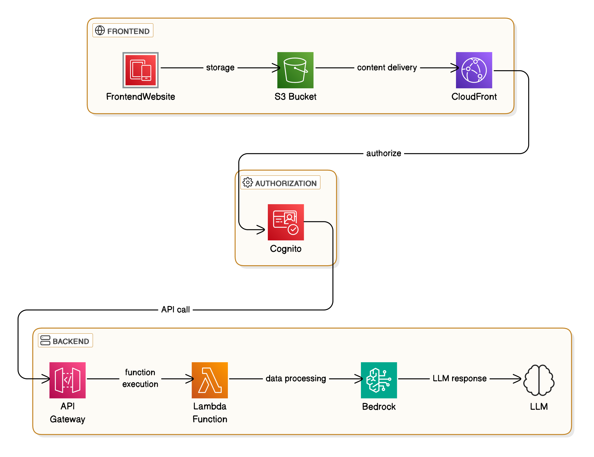
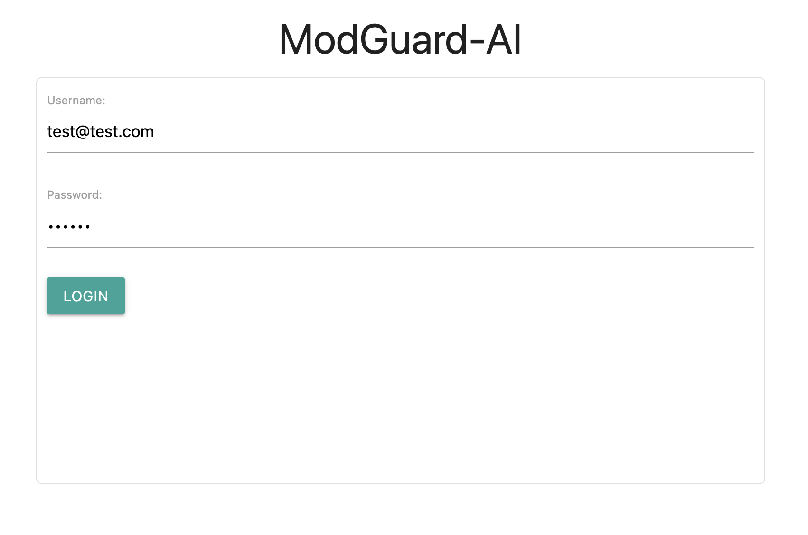
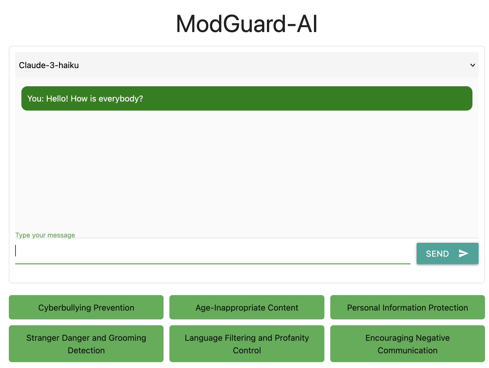
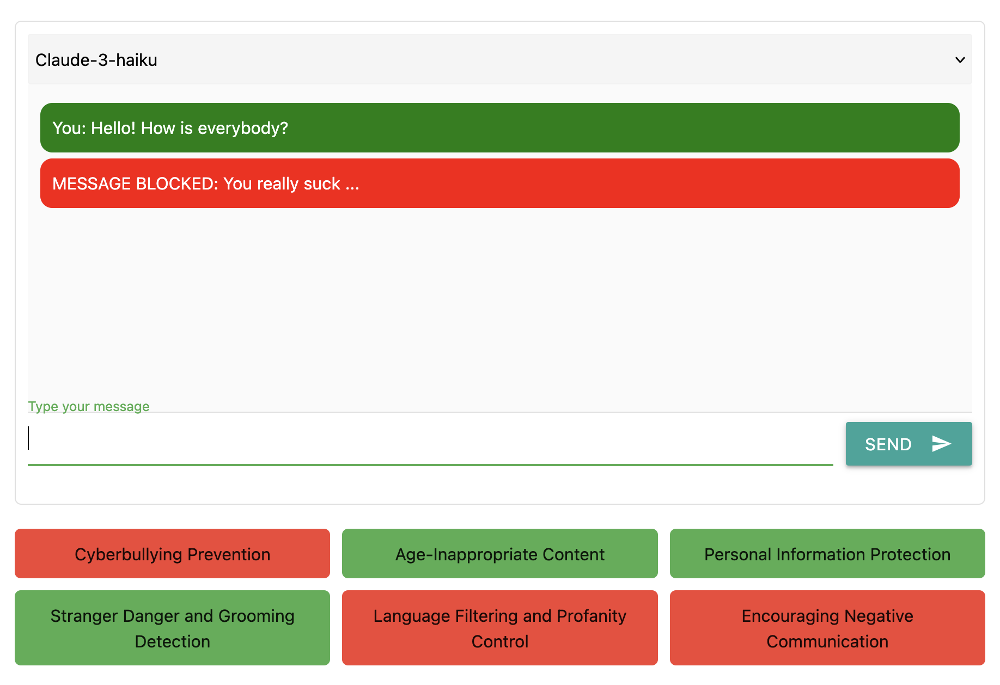
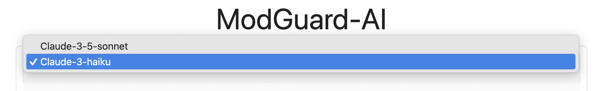

# ModGuard-AI for Agentic Content Moderation

## Table of Contents
- [Overview](#overview)
- [LLM task definition](#llm-tasks-definition)
- [Architecture](#architecture)
- [Technologies Used](#technologies-used)
- [User Flow](#user-flow)
- [Prerequisites](#prerequisites)
- [Installation](#installation)
- [Deployment](#deployment)
- [Design Choices](#design-choices)
- [Future Improvements](#future-improvements)
- [License](#license)

---

## Overview

This project demonstrates a serverless application designed as a chat moderation tool for a children's platform, utilizing a Large Language Model (LLM) via AWS Bedrock. The application consists of a backend service and a frontend user interface. The backend processes chat messages, leverages AWS Bedrock to analyze the content through an LLM, and flags messages based on specific moderation categories. The frontend provides an intuitive interface for monitoring and managing flagged messages.

---

## LLM tasks definition

The Large Language Model (LLM) is responsible for analyzing chat messages and flagging them into specific moderation categories. When a user wants to send a message in the chat, the LLM processes the message and attempts to identify if it falls into the categories:
- Cyberbullying Prevention
- Age-Inappropriate Content
- Personal Information Protection
- Stranger Danger and Grooming Detection
- Language Filtering and Profanity Control
- Encouraging Negative Communication.

---

## Architecture



This application is a serverless chat interface that performs message moderation using Large Language Models (LLMs). It leverages AWS services for scalability, security, and real-time processing.

1. **Frontend**:
   - **Frontend/Website**: The frontend is a simple web application that allows users to interact with the chat interface.
   - **S3 Bucket**: The S3 bucket stores static website assets (HTML, CSS, JS).
   - **CloudFront**: CloudFront caches and delivers the frontend assets to users worldwide, ensuring low latency and high performance.

2. **Authorization**:
   - **Cognito**: AWS Cognito manages user authentication and authorization, ensuring that only authorized users can access the chat application.

3. **Backend**:
   - **API Gateway**: The frontend communicates with the backend through API Gateway, which exposes RESTful endpoints for interaction with the system.
   - **Lambda Function**: API Gateway invokes Lambda functions to handle requests. The Lambda function processes chat messages and forwards them for moderation.
   - **Bedrock**: Amazon Bedrock, integrated with LLMs, performs message moderation by analyzing and processing the content.
   - **LLM**: The LLM (Large Language Model) returns a moderated response, ensuring compliance with predefined content policies.

---

## Technologies Used

- **Python** for backend development with AWS CDK.
- **HTML/CSS/JavaScript** for the frontend interface.
- **Amazon S3** for frontend hosting.
- **Amazon CloudFront** for global content delivery.
- **Amazon Cognito** for user authentication and identity management.
- **Amazon API Gateway** to handle HTTP requests.
- **AWS Lambda** for serverless computing.
- **AWS Bedrock** for Large Language Model interactions.

---

## User Flow

1. An account is created by the administrator using AWS Cognito console.
2. The user logs in to the chat interface using the credentials.



3. The user enters a message in the chat interface and submits it. The message is sent to the backend for moderation. 



4. When a moderation category is matched, the message is flagged and blocked.



5. The user can change the LLM model used for moderation.



## Prerequisites

Before setting up this application, ensure you have the following:

- Linux based system
- AWS account with access to AWS Bedrock and required services.
- Conda installed
- Node.js installed
  
---

## Installation

1. Clone the repository:

    ```bash
    git clone https://github.com/CretuCalin/ModGuard-AI
    cd ModGuard-AI
    ```

2. Create and activate the conda environment:

    ```bash
    conda env create -f environment.yaml
    conda activate modguard
    ```

3. Configure AWS CLI with your credentials:

    ```bash
    aws configure
    ```

---

## Deployment

1. Deploy the backend stack:

    ```bash
    cd cdk
    cdk deploy ModGuardStackBackend
    ```

2. Save output variables from the previous step console logs: 
        
    ```sh
    # Console logs example
    ModGuardStackBackend.ModGuardApiEndpoint9C8CED68 = https://gqake4g4t6.execute-api.eu-west-1.amazonaws.com/prod/
    ModGuardStackBackend.userPoolClientId = 706fc7hi7r73nlpiqmtlgfcgs9
    ModGuardStackBackend.userPoolId = eu-west-1_TBJgrnzXC
    ```

3. Paste the value in the `frontend/app.js` file:
    ```js
    // In the file: /frontend/app.js
    const ApiUrl = "<Insert value from ModGuardStackBackend.ModGuardApiEndpoint9C8CED68>";

    // In the file: /frontend/index.js
    const UserPoolIdValue = "<Insert value from ModGuardStackBackend.userPoolId>";
    const ClientIdValue = "<Insert value from ModGuardStackBackend.userPoolClientId>";
    ```

4. Deploy the website stack:
        ```sh
        cdk deploy ModGuardStackWebsite
        ```
---

## Design choices

- **Serverless Architecture with AWS Lambda:**
  - **Alternative:** EC2 instances for running backend services.
  - **Reason:** Lambda is cost-efficient as you only pay for the compute time you consume, and it scales automatically.

- **Static Frontend Hosting with Amazon S3:**
  - **Alternative:** Hosting on EC2 or using AWS Amplify.
  - **Reason:** S3 is highly cost-effective for serving static content and integrates seamlessly with CloudFront for global delivery.

- **User Authentication with Amazon Cognito:**
  - **Alternative:** Implementing custom authentication or using third-party identity providers.
  - **Reason:** Cognito provides a scalable and secure solution for user authentication without the need to manage user credentials directly.

---

## Future Improvements

### Operational Excellence

- **Setup CI/CD Pipeline:**
  - Implement a CI/CD pipeline using AWS CodePipeline or GitHub Actions for automated testing and deployment, ensuring consistent and reliable application updates.

- **Setup CloudWatch Alarms:**
  - Configure Amazon CloudWatch alarms to monitor application performance, resource utilization, and especially the LLM response time, enabling proactive issue detection and resolution.

### Security

- **Enhanced User Management with AWS Amplify:**
  - Integrate AWS Amplify for a more streamlined user management experience, including user registration, authentication, and authorization, ensuring secure and scalable user management.

### Reliability

- **Implement Moderation through Amazon OpenSearch Service (former Elasticsearch):**
  - Use Amazon OpenSearch Service for real-time indexing and searching of chat messages, enabling faster and more cost-efficient moderation capabilities, and improving the reliability of the moderation process.

### Performance Efficiency

- **Amazon Bedrock Prompt Caching:**
  - Implement caching for LLM prompts to reduce latency and improve response times, enhancing the overall performance of the application.

### Cost Optimization

- **Amazon Bedrock Prompt Caching:**
  - Implement caching for LLM prompts to reduce costs associated with repeated processing of the same prompts, optimizing the cost-efficiency of the application.

---

## License

This project is licensed under the MIT License - see the [LICENSE](LICENSE) file for details.
